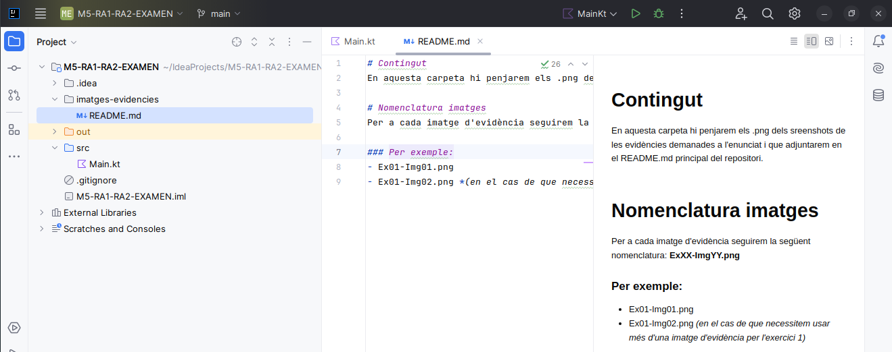
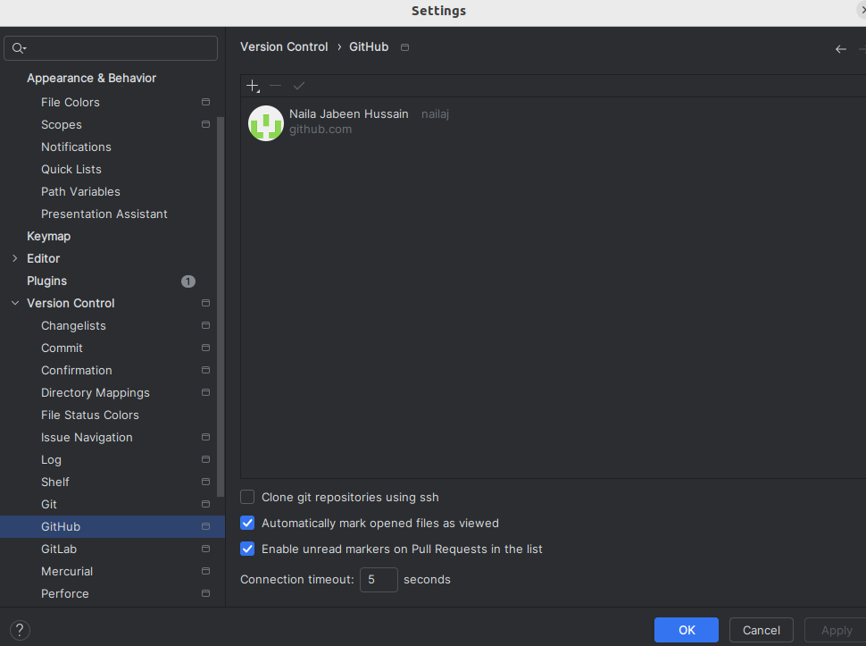
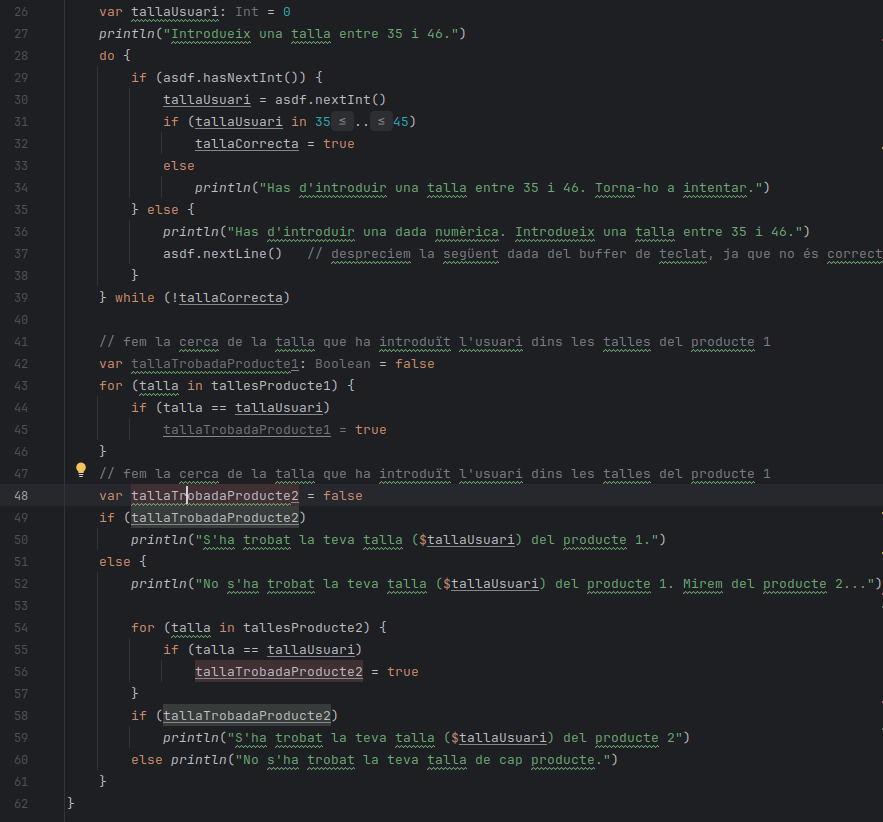
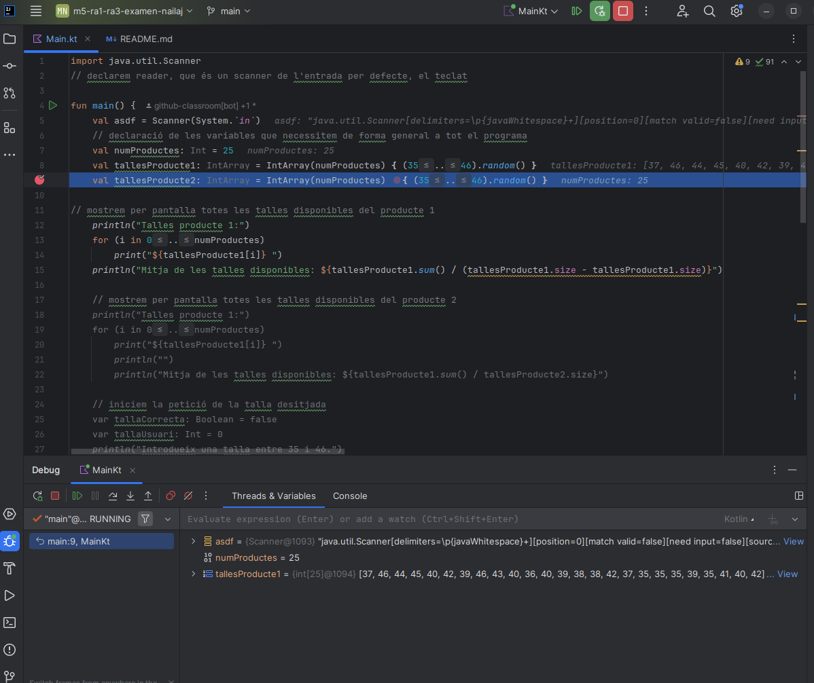
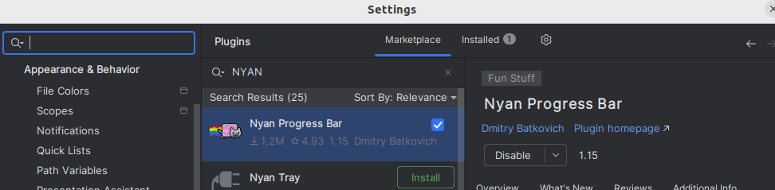
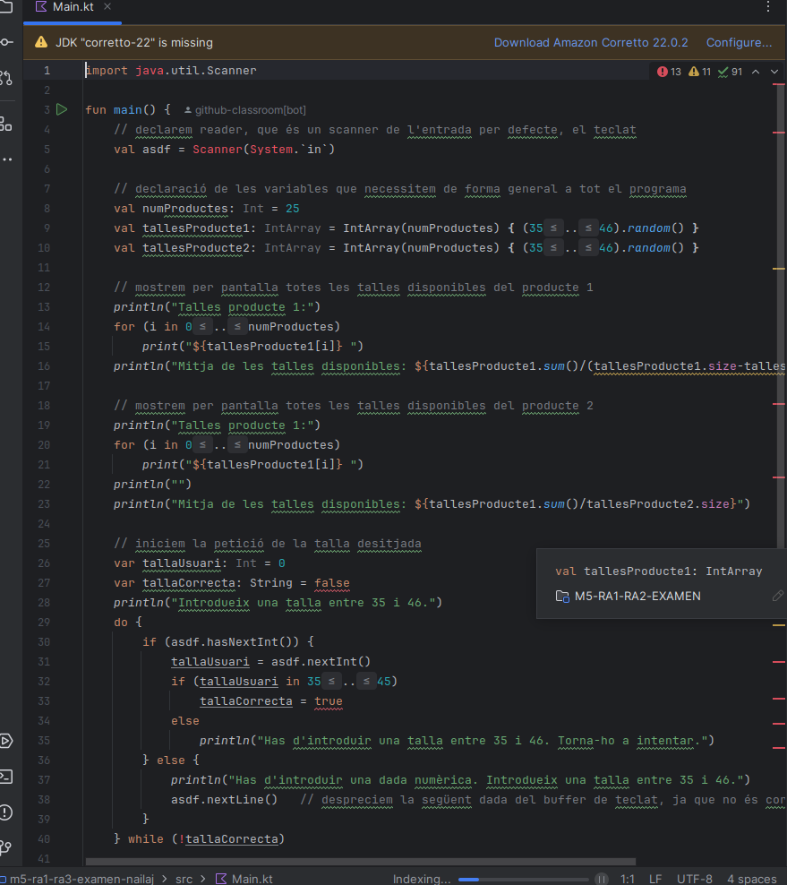
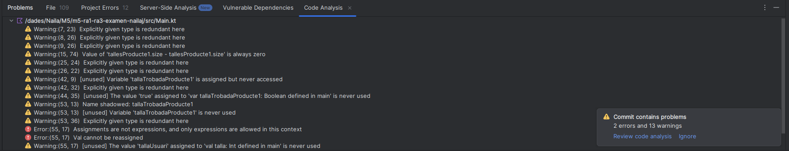

# Full d'evidències
Usarem aquest **README.md** per a acumular un registre de totes les evidències demanades als exercicis de l'enunciat de l'examen.

Les evidències seràn captures de pantalla on es mostri clarament el vostre usuari i l'acció demanada.

El format de les evidències seran arxius d'imatge tipus *.png*

Pugeu les fotos de les evidències dins de la carpeta **[imatges-evidencies](imatges_evidencies)**

Editeu aquest fitxer README.md des de IntelliJ o des d'aquí mateix.

---
# Entrega d'evidències

## Evidències Exercici 00
Exemple d'evidència:

## Evidències Exercici 01
### Evidència/es a

### Evidència/es b
![imatges_evidencies]/readme.png
## Evidències Exercici 02
### Evidència/es a

### Evidència/es b

### Evidència/es c
### Evidència/es d

### Evidència/es e
### Evidència/es f
### Evidència/es g
### Evidència/es h

## Evidències Exercici 03
### Evidència/es a

### Evidència/es b
![imatges_evidencies]/Ex3-b.png
### Evidència/es c
### Evidència/es d

### Evidència/es e

